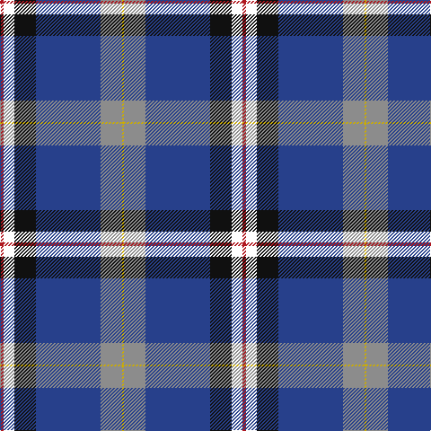

The parent of this is [Alan Stone Family (Personal)](/tartans/r/4/w12/k24/b72/n24/y/2/)

This was sourced from register-of-tartans.  It is a [6 stripes tartan](/stripes/stripes6/).

Original link https://www.tartanregister.gov.uk/tartanDetails.aspx?ref=10133

## Thread count
R/4 W12 K24 B72 N24 Y/2

## Palette
Each colour and its ΔE from the base-6 reference it is a variant of.

| Colour | Shade | Base | ΔE (OKLab) |
|---|---|---|---|
| B |  `#27408B` | B  | 0.01 |
| K |  `#101010` | K  | 0.17 |
| N |  `#8C8C8C` | R  | 0.24 |
| R |  `#B0171F` | R  | 0.05 |
| W |  `#FFFFFF` | W  | 0.03 |
| Y |  `#CDAD00` | Y  | 0.07 |

# Sample pattern

ID: /variants/r/4/w12/k24/b72/n24/y/2-b27408b-k101010-n8c8c8c-rb0171f-wffffff-ycdad00/
