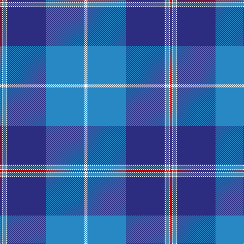

The parent of this is [Bousie (Personal)](/tartans/r/4/w2/b6/w2/db76/ba76/w/6/)

This was sourced from tartans-authority.  It is a [7 stripes tartan](/stripes/stripes7/).

Original link http://www.tartansauthority.com/tartan-ferret/display/6795/

## Thread count
R/4 W2 B6 W2 DB76 Ba76 W/6

## Palette
Each colour and its ΔE from the base-6 reference it is a variant of.

| Colour | Shade | Base | ΔE (OKLab) |
|---|---|---|---|
| B |  `#5C8CA8` | B  | 0.23 |
| Ba |  `#2888C4` | B  | 0.21 |
| DB |  `#2C2C80` | B  | 0.05 |
| R |  `#C80000` | R  | 0.00 |
| W |  `#F8F8F8` | W  | 0.01 |

# Sample pattern

ID: /variants/r/4/w2/b6/w2/db76/ba76/w/6-b5c8ca8-ba2888c4-db2c2c80-rc80000-wf8f8f8/
