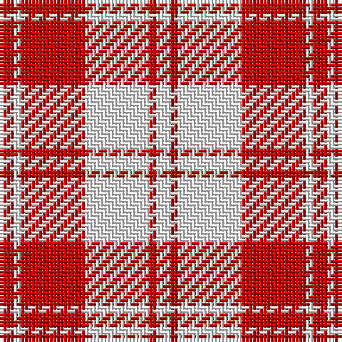

The parent of this is [Erskine Red & White (Dance)](/tartans/r/4/w2/r18/w18/r2/w/4/)

This was sourced from tartans-authority.  It is a [6 stripes tartan](/stripes/stripes6/).

Original link http://www.tartansauthority.com/tartan-ferret/display/8897/

## Thread count
R/4 W2 R18 W18 R2 W/4

## Palette
Each colour and its ΔE from the base-6 reference it is a variant of.

| Colour | Shade | Base | ΔE (OKLab) |
|---|---|---|---|
| R |  `#C80000` | R  | 0.00 |
| W |  `#FCFCFC` | W  | 0.03 |

# Sample pattern

ID: /variants/r/4/w2/r18/w18/r2/w/4-rc80000-wfcfcfc/
