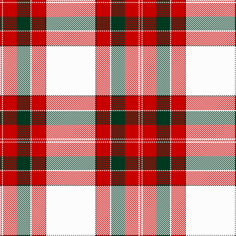

The parent of this is [Wilson's Blanket Pattern](/tartans/r/4/w2/r28/dg28/w2/r28/k2/w/100/)

This was sourced from register-of-tartans.  It is a [8 stripes tartan](/stripes/stripes8/).

Original link https://www.tartanregister.gov.uk/tartanDetails.aspx?ref=5152

## Thread count
R/4 W2 R28 DG28 W2 R28 K2 W/100

## Palette
Each colour and its ΔE from the base-6 reference it is a variant of.

| Colour | Shade | Base | ΔE (OKLab) |
|---|---|---|---|
| DG |  `#003820` | G  | 0.16 |
| G |  `#006818` | G  | 0.02 |
| K |  `#101010` | K  | 0.17 |
| LN |  `#E0E0E0` | W  | 0.06 |
| N |  `#C0C0C0` | W  | 0.16 |
| R |  `#C80000` | R  | 0.00 |
| W |  `#FCFCFC` | W  | 0.03 |

# Sample pattern

ID: /variants/r/4/w2/r28/dg28/w2/r28/k2/w/100-dg003820-g006818-k101010-lne0e0e0-nc0c0c0-rc80000-wfcfcfc/
