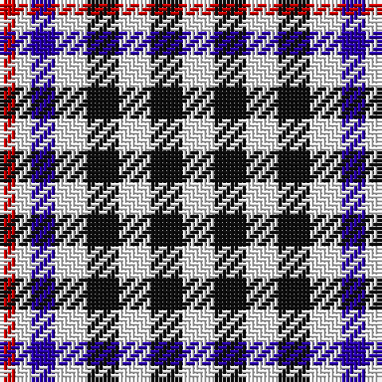

The parent of this is [Scott, Sir Walter - 1971 (Fashion)](/tartans/r/4/w4/db6/w8/k8/w8/k8/w/8/)

This was sourced from tartans-authority.  It is a [8 stripes tartan](/stripes/stripes8/).

Original link http://www.tartansauthority.com/tartan-ferret/display/1240/

## Thread count
R/4 W4 DB6 W8 K8 W8 K8 W/8

## Palette
Each colour and its ΔE from the base-6 reference it is a variant of.

| Colour | Shade | Base | ΔE (OKLab) |
|---|---|---|---|
| DB |  `#2800A8` | B  | 0.11 |
| K |  `#101010` | K  | 0.17 |
| R |  `#C80000` | R  | 0.00 |
| W |  `#FCFCFC` | W  | 0.03 |

# Sample pattern

ID: /variants/r/4/w4/db6/w8/k8/w8/k8/w/8-db2800a8-k101010-rc80000-wfcfcfc/
