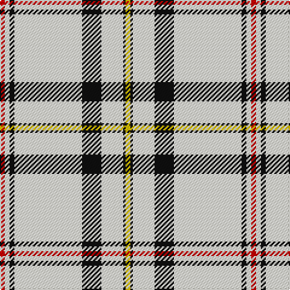

The parent of this is [Summer Spirit (Fashion)](/tartans/r/4/w4/k4/w56/k16/w18/k2/y/4/)

This was sourced from tartans-authority.  It is a [8 stripes tartan](/stripes/stripes8/).

Original link http://www.tartansauthority.com/tartan-ferret/display/6824/

## Thread count
R/4 W4 K4 W56 K16 W18 K2 Y/4

## Palette
Each colour and its ΔE from the base-6 reference it is a variant of.

| Colour | Shade | Base | ΔE (OKLab) |
|---|---|---|---|
| K |  `#101010` | K  | 0.17 |
| R |  `#C80000` | R  | 0.00 |
| W |  `#FCFCEC` | W  | 0.03 |
| Y |  `#E8C000` | Y  | 0.00 |

# Sample pattern

ID: /variants/r/4/w4/k4/w56/k16/w18/k2/y/4-k101010-rc80000-wfcfcec-ye8c000/
