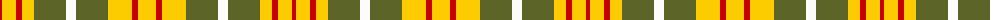

The parent of this is [J & B Whisky (Original) (Corporate)](/tartans/r/4/y14/r6/y12/g32/w10/g32/y24/r6/y/18/)

This was sourced from tartans-authority.  It is a [10 stripes tartan](/stripes/stripes10/).

Original link http://www.tartansauthority.com/tartan-ferret/display/6073/

## Thread count
R/4 Y14 R6 Y12 G32 W10 G32 Y24 R6 Y/18

## Palette
Each colour and its ΔE from the base-6 reference it is a variant of.

| Colour | Shade | Base | ΔE (OKLab) |
|---|---|---|---|
| G |  `#5C6428` | G  | 0.09 |
| R |  `#C80000` | R  | 0.00 |
| W |  `#FCFCFC` | W  | 0.03 |
| Y |  `#FCCC00` | Y  | 0.04 |

ID: /variants/r/4/y14/r6/y12/g32/w10/g32/y24/r6/y/18-g5c6428-rc80000-wfcfcfc-yfccc00/
