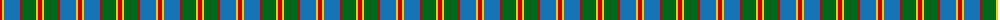
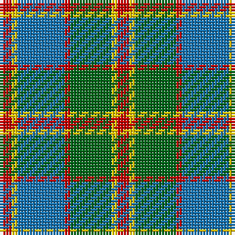

The parent of this is [Cercle de Fermieres de St-Elie . . .](/tartans/r/4/y2/b16/r2/g14/y2/r/4/)

This was sourced from tartans-authority.  It is a [7 stripes tartan](/stripes/stripes7/).

Original link http://www.tartansauthority.com/tartan-ferret/display/10392/

## Thread count
R/4 Y2 B16 R2 G14 Y2 R/4

## Palette
Each colour and its ΔE from the base-6 reference it is a variant of.

| Colour | Shade | Base | ΔE (OKLab) |
|---|---|---|---|
| B |  `#1474B4` | B  | 0.15 |
| G |  `#006818` | G  | 0.02 |
| R |  `#C80000` | R  | 0.00 |
| Y |  `#FCCC00` | Y  | 0.04 |

# Sample pattern

ID: /variants/r/4/y2/b16/r2/g14/y2/r/4-b1474b4-g006818-rc80000-yfccc00/
