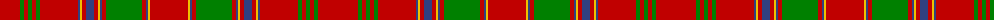

The parent of this is [Munro](/tartans/r/40/g4/r4/g4/r4/g4/r38/b2/y2/r4/b8/r4/y2/b2/r4/g36/r4/b2/y2/r/38/)

This was sourced from weddslist.  It is a [20 stripes tartan](/stripes/stripes20/).

Original link http://www.weddslist.com/cgi-bin/tartans/pg.pl?source=sts

## Thread count
R/40 G4 R4 G4 R4 G4 R38 B2 Y2 R4 B8 R4 Y2 B2 R4 G36 R4 B2 Y2 R/38

## Palette
Each colour and its ΔE from the base-6 reference it is a variant of.

| Colour | Shade | Base | ΔE (OKLab) |
|---|---|---|---|
| B |  `#304080` | B  | 0.01 |
| G |  `#008000` | G  | 0.09 |
| R |  `#C00000` | R  | 0.02 |
| Y |  `#F0C000` | Y  | 0.01 |

ID: /variants/r/40/g4/r4/g4/r4/g4/r38/b2/y2/r4/b8/r4/y2/b2/r4/g36/r4/b2/y2/r/38-b304080-g008000-rc00000-yf0c000/
