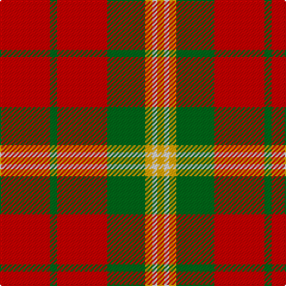

The parent of this is [Claus of the North Pole (Restricted)](/tartans/r/42/g6/r42/g32/y6/ln4/y/6/)

This was sourced from register-of-tartans.  It is a [7 stripes tartan](/stripes/stripes7/).

Original link https://www.tartanregister.gov.uk/tartanDetails.aspx?ref=5816

## Thread count
R/42 G6 R42 G32 Y6 LN4 Y/6

## Palette
Each colour and its ΔE from the base-6 reference it is a variant of.

| Colour | Shade | Base | ΔE (OKLab) |
|---|---|---|---|
| G |  `#006818` | G  | 0.02 |
| LN |  `#DCDCE0` | W  | 0.07 |
| R |  `#C80000` | R  | 0.00 |
| Y |  `#F4A404` | Y  | 0.07 |

# Sample pattern

ID: /variants/r/42/g6/r42/g32/y6/ln4/y/6-g006818-lndcdce0-rc80000-yf4a404/
