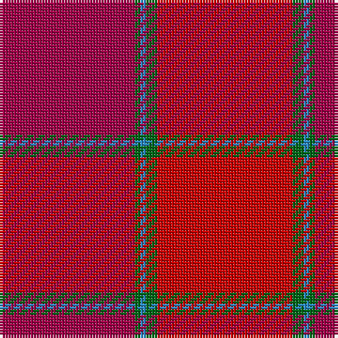

The parent of this is [MacNab (Smith)](/tartans/r/48/g2/b2/g4/ra/48/)

This was sourced from register-of-tartans.  It is a [5 stripes tartan](/stripes/stripes5/).

Original link https://www.tartanregister.gov.uk/tartanDetails.aspx?ref=2671

## Thread count
R/48 G2 B2 G4 Ra/48

## Palette
Each colour and its ΔE from the base-6 reference it is a variant of.

| Colour | Shade | Base | ΔE (OKLab) |
|---|---|---|---|
| B |  `#2888C4` | B  | 0.21 |
| G |  `#006818` | G  | 0.02 |
| R |  `#A00048` | R  | 0.11 |
| Ra |  `#C80000` | R  | 0.00 |

# Sample pattern

ID: /variants/r/48/g2/b2/g4/ra/48-b2888c4-g006818-ra00048-rac80000/
