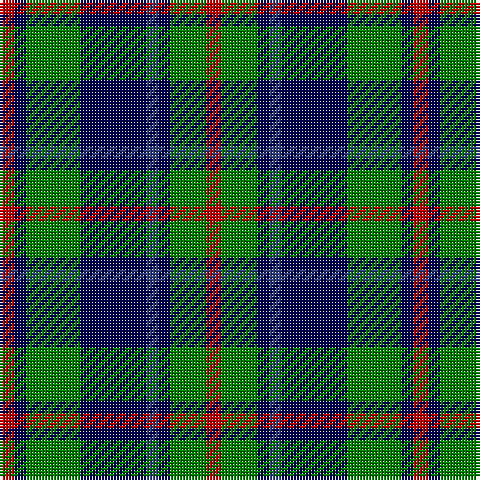

The parent of this is [Daks, Navy](/tartans/r/5/db4/g18/db22/b4/db4/g12/r/5/)

This was sourced from weddslist.  It is a [8 stripes tartan](/stripes/stripes8/).

Original link http://www.weddslist.com/cgi-bin/tartans/pg.pl?source=sts

## Thread count
R/5 DB4 G18 DB22 B4 DB4 G12 R/5

## Palette
Each colour and its ΔE from the base-6 reference it is a variant of.

| Colour | Shade | Base | ΔE (OKLab) |
|---|---|---|---|
| B |  `#304080` | B  | 0.01 |
| DB |  `#000050` | B  | 0.20 |
| G |  `#008000` | G  | 0.09 |
| R |  `#C00000` | R  | 0.02 |

# Sample pattern

ID: /variants/r/5/db4/g18/db22/b4/db4/g12/r/5-b304080-db000050-g008000-rc00000/
