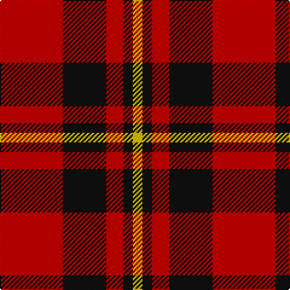

The parent of this is [Haig Corporate Tartan Tartan Number: 1609. Earliest known date: 1979 For Messrs John Haig. See products available Copyright © Blair Urquhart, Comrie, 2015](/tartans/r/52/k36/r14/k8/y/8/)

This was sourced from house-of-tartan.  It is a [5 stripes tartan](/stripes/stripes5/).

Original link http://www.house-of-tartan.scotland.net/house/TartanViewjs.asp?colr=Def&tnam=1609

## Thread count
R/52 K36 R14 K8 Y/8

## Palette
Each colour and its ΔE from the base-6 reference it is a variant of.

| Colour | Shade | Base | ΔE (OKLab) |
|---|---|---|---|
| K |  `#101010` | K  | 0.17 |
| R |  `#C80000` | R  | 0.00 |
| Y |  `#E8C000` | Y  | 0.00 |

# Sample pattern

ID: /variants/r/52/k36/r14/k8/y/8-k101010-rc80000-ye8c000/
