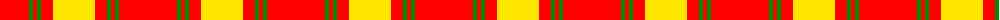
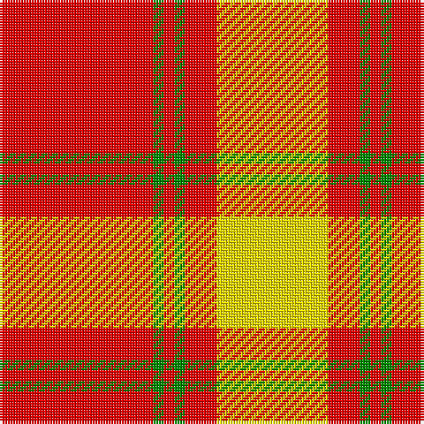

The parent of this is [Maguire, Black](/tartans/r/58/g4/r4/g4/r12/y/42/)

This was sourced from register-of-tartans.  It is a [6 stripes tartan](/stripes/stripes6/).

Original link https://www.tartanregister.gov.uk/tartanDetails.aspx?ref=2785

## Thread count
R/58 G4 R4 G4 R12 Y/42

## Palette
Each colour and its ΔE from the base-6 reference it is a variant of.

| Colour | Shade | Base | ΔE (OKLab) |
|---|---|---|---|
| G |  `#008B00` | G  | 0.12 |
| R |  `#FF0000` | R  | 0.11 |
| Y |  `#FFE600` | Y  | 0.10 |

# Sample pattern

ID: /variants/r/58/g4/r4/g4/r12/y/42-g008b00-rff0000-yffe600/
