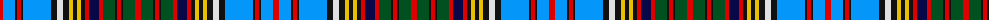

The parent of this is [Anderson (Coulson Bonner #2)](/tartans/r/6/b12/k2/r4/k2/b28/k6/ln6/k6/y4/k4/y4/k4/r4/db10/r4/g12/k2/r4/k2/g12/r/6/)

This was sourced from register-of-tartans.  It is a [22 stripes tartan](/stripes/stripes22/).

Original link https://www.tartanregister.gov.uk/tartanDetails.aspx?ref=79

## Thread count
R/6 B12 K2 R4 K2 B28 K6 LN6 K6 Y4 K4 Y4 K4 R4 DB10 R4 G12 K2 R4 K2 G12 R/6

## Palette
Each colour and its ΔE from the base-6 reference it is a variant of.

| Colour | Shade | Base | ΔE (OKLab) |
|---|---|---|---|
| B |  `#0596FA` | B  | 0.28 |
| DB |  `#080848` | B  | 0.19 |
| G |  `#005020` | G  | 0.08 |
| K |  `#101010` | K  | 0.17 |
| LN |  `#E0E0E0` | W  | 0.06 |
| R |  `#DC0000` | R  | 0.04 |
| Y |  `#E8C000` | Y  | 0.00 |

ID: /variants/r/6/b12/k2/r4/k2/b28/k6/ln6/k6/y4/k4/y4/k4/r4/db10/r4/g12/k2/r4/k2/g12/r/6-b0596fa-db080848-g005020-k101010-lne0e0e0-rdc0000-ye8c000/
