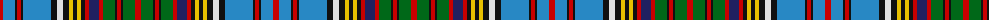

The parent of this is [Anderson Variant Clan Tartan Tartan Number: 1350. Earliest known date: pre 2003 This sample comes from the MacGregor-Hastie collection which forms the basis of the cloth archive of the Scottish Tartans Society. Some of the samples, including this one, were unmarked. One can assume that the sample dates between 1930 and 1950. See products available Copyright © Blair Urquhart, Comrie, 2015](/tartans/r/6/b12/k2/r4/k2/b28/k6/ln6/k6/y4/k4/y4/k4/r4/db10/r4/g12/k2/r4/k2/g12/r/6/)

This was sourced from house-of-tartan.  It is a [22 stripes tartan](/stripes/stripes22/).

Original link http://www.house-of-tartan.scotland.net/house/TartanViewjs.asp?colr=Def&tnam=1350

## Thread count
R/6 B12 K2 R4 K2 B28 K6 LN6 K6 Y4 K4 Y4 K4 R4 DB10 R4 G12 K2 R4 K2 G12 R/6

## Palette
Each colour and its ΔE from the base-6 reference it is a variant of.

| Colour | Shade | Base | ΔE (OKLab) |
|---|---|---|---|
| B |  `#2888C4` | B  | 0.21 |
| DB |  `#202060` | B  | 0.11 |
| G |  `#006818` | G  | 0.02 |
| K |  `#101010` | K  | 0.17 |
| LN |  `#E0E0E0` | W  | 0.06 |
| R |  `#C80000` | R  | 0.00 |
| Y |  `#E8C000` | Y  | 0.00 |

ID: /variants/r/6/b12/k2/r4/k2/b28/k6/ln6/k6/y4/k4/y4/k4/r4/db10/r4/g12/k2/r4/k2/g12/r/6-b2888c4-db202060-g006818-k101010-lne0e0e0-rc80000-ye8c000/
