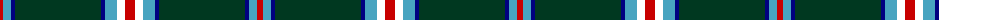
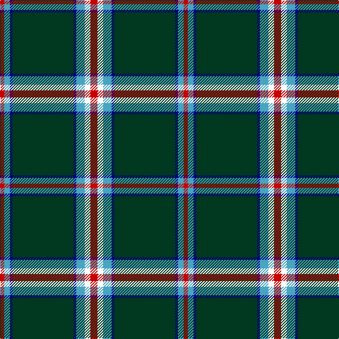

The parent of this is [Mullikin (2013)](/tartans/r/6/b8/db4/dg86/db4/b12/w8/r/10/)

This was sourced from register-of-tartans.  It is a [8 stripes tartan](/stripes/stripes8/).

Original link https://www.tartanregister.gov.uk/tartanDetails.aspx?ref=10863

## Thread count
R/6 B8 DB4 DG86 DB4 B12 W8 R/10

## Palette
Each colour and its ΔE from the base-6 reference it is a variant of.

| Colour | Shade | Base | ΔE (OKLab) |
|---|---|---|---|
| B |  `#48A4C0` | Y  | 0.28 |
| DB |  `#000080` | B  | 0.14 |
| DG |  `#003820` | G  | 0.16 |
| R |  `#C80000` | R  | 0.00 |
| W |  `#FFFFFF` | W  | 0.03 |

# Sample pattern

ID: /variants/r/6/b8/db4/dg86/db4/b12/w8/r/10-b48a4c0-db000080-dg003820-rc80000-wffffff/
