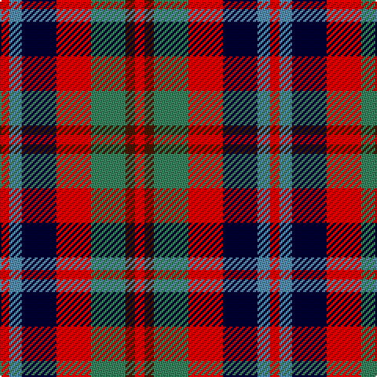

The parent of this is [Stewart /Stuart- Fragment Cf 1452 & 1445](/tartans/r/6/b8/dba22/r22/g22/dr6/r/6/)

This was sourced from register-of-tartans.  It is a [7 stripes tartan](/stripes/stripes7/).

Original link https://www.tartanregister.gov.uk/tartanDetails.aspx?ref=3932

## Thread count
R/6 B8 DBa22 R22 G22 DR6 R/6

## Palette
Each colour and its ΔE from the base-6 reference it is a variant of.

| Colour | Shade | Base | ΔE (OKLab) |
|---|---|---|---|
| B |  `#5C8CA8` | B  | 0.23 |
| DB |  `#2C2C80` | B  | 0.05 |
| DBa |  `#00002C` | K  | 0.16 |
| DBb |  `#003C64` | B  | 0.07 |
| DR |  `#441800` | B  | 0.22 |
| G |  `#408060` | G  | 0.13 |
| N |  `#344054` | B  | 0.08 |
| R |  `#C80000` | R  | 0.00 |

# Sample pattern

ID: /variants/r/6/b8/dba22/r22/g22/dr6/r/6-b5c8ca8-db2c2c80-dba00002c-dbb003c64-dr441800-g408060-n344054-rc80000/
