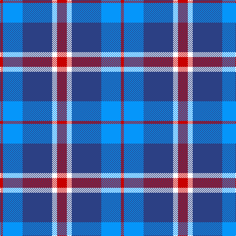

The parent of this is [Lands of Liberty](/tartans/r/6/ba40/b60/w10/r/20/)

This was sourced from register-of-tartans.  It is a [5 stripes tartan](/stripes/stripes5/).

Original link https://www.tartanregister.gov.uk/tartanDetails.aspx?ref=10928

## Thread count
R/6 Ba40 B60 W10 R/20

## Palette
Each colour and its ΔE from the base-6 reference it is a variant of.

| Colour | Shade | Base | ΔE (OKLab) |
|---|---|---|---|
| B |  `#2C4084` | B  | 0.00 |
| Ba |  `#0596FA` | B  | 0.28 |
| R |  `#C80000` | R  | 0.00 |
| W |  `#FFFFFF` | W  | 0.03 |

# Sample pattern

ID: /variants/r/6/ba40/b60/w10/r/20-b2c4084-ba0596fa-rc80000-wffffff/
