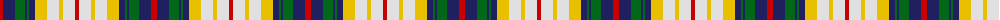

The parent of this is [Canice-Moodie (Personal)](/tartans/r/6/db12/g10/db2/g2/db6/y12/ln12/y4/ln12/r/4/)

This was sourced from tartans-authority.  It is a [11 stripes tartan](/stripes/stripes11/).

Original link http://www.tartansauthority.com/tartan-ferret/display/4544/

## Thread count
R/6 DB12 G10 DB2 G2 DB6 Y12 LN12 Y4 LN12 R/4

## Palette
Each colour and its ΔE from the base-6 reference it is a variant of.

| Colour | Shade | Base | ΔE (OKLab) |
|---|---|---|---|
| DB |  `#202060` | B  | 0.11 |
| G |  `#006818` | G  | 0.02 |
| LN |  `#E0E0E0` | W  | 0.06 |
| R |  `#C80000` | R  | 0.00 |
| Y |  `#E8C000` | Y  | 0.00 |

ID: /variants/r/6/db12/g10/db2/g2/db6/y12/ln12/y4/ln12/r/4-db202060-g006818-lne0e0e0-rc80000-ye8c000/
