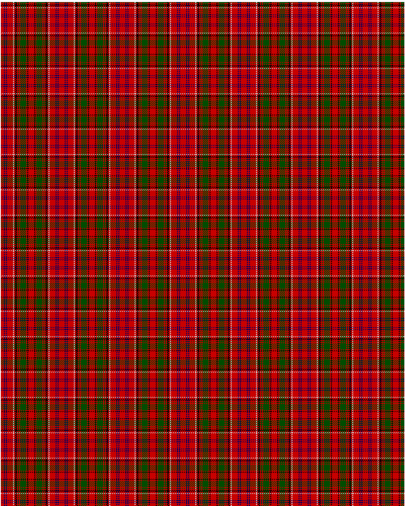

The parent of this is [Drummond C](/tartans/r/6/db2/r2/db2/r12/n2/r2/k4/r2/g2/r2/g12/r2/k2/r/6/)

This was sourced from <no value>.  It is a [15 stripes tartan](/stripes/stripes15/).

Original link http://www.weddslist.com/cgi-bin/tartans/pg.pl?source=rb

## Thread count
R/6 DB2 R2 DB2 R12 N2 R2 K4 R2 G2 R2 G12 R2 K2 R/6

## Palette
DB G K N R

# Sample pattern

ID: /variants/r/6/db2/r2/db2/r12/n2/r2/k4/r2/g2/r2/g12/r2/k2/r/6-db000064-g004c00-k000000-nd0d0d0-rc80000/