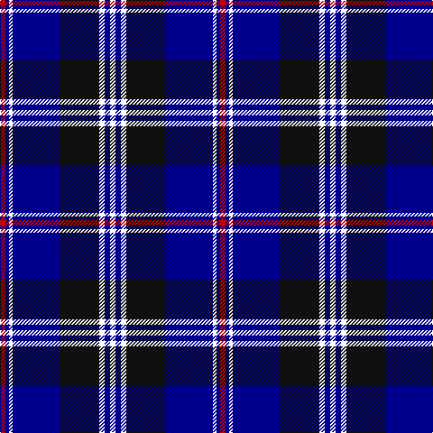

The parent of this is [DeCloud-McMasters (Personal)](/tartans/r/6/db4/w4/db52/k44/w6/db6/w/6/)

This was sourced from register-of-tartans.  It is a [8 stripes tartan](/stripes/stripes8/).

Original link https://www.tartanregister.gov.uk/tartanDetails.aspx?ref=11132

## Thread count
R/6 DB4 W4 DB52 K44 W6 DB6 W/6

## Palette
Each colour and its ΔE from the base-6 reference it is a variant of.

| Colour | Shade | Base | ΔE (OKLab) |
|---|---|---|---|
| DB |  `#00008C` | B  | 0.13 |
| K |  `#101010` | K  | 0.17 |
| R |  `#C80000` | R  | 0.00 |
| W |  `#FFFFFF` | W  | 0.03 |

# Sample pattern

ID: /variants/r/6/db4/w4/db52/k44/w6/db6/w/6-db00008c-k101010-rc80000-wffffff/
