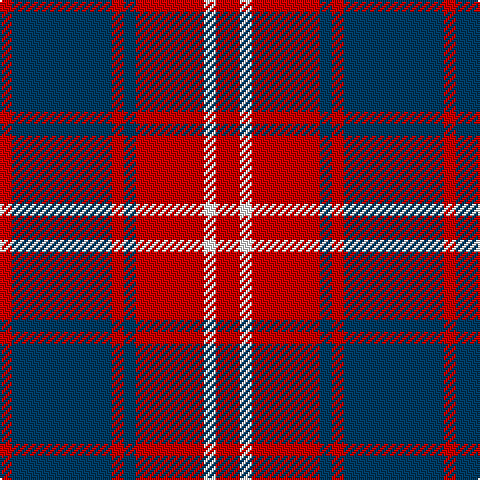

The parent of this is [Bon Accord (District)](/tartans/r/6/db50/r6/db6/r34/w6/r/12/)

This was sourced from tartans-authority.  It is a [7 stripes tartan](/stripes/stripes7/).

Original link http://www.tartansauthority.com/tartan-ferret/display/2229/

## Thread count
R/6 DB50 R6 DB6 R34 W6 R/12

## Palette
Each colour and its ΔE from the base-6 reference it is a variant of.

| Colour | Shade | Base | ΔE (OKLab) |
|---|---|---|---|
| DB |  `#003C64` | B  | 0.07 |
| R |  `#C80000` | R  | 0.00 |
| W |  `#FCFCFC` | W  | 0.03 |

# Sample pattern

ID: /variants/r/6/db50/r6/db6/r34/w6/r/12-db003c64-rc80000-wfcfcfc/
