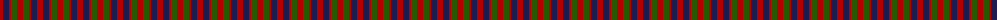
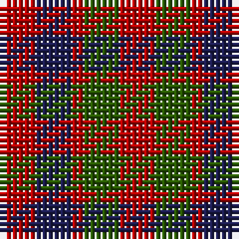

The parent of this is [Gow (Portrait)](/tartans/r/6/db6/r2/g6/r/6/)

This was sourced from tartans-authority.  It is a [5 stripes tartan](/stripes/stripes5/).

Original link http://www.tartansauthority.com/tartan-ferret/display/1390/

## Thread count
R/6 DB6 R2 G6 R/6

## Palette
Each colour and its ΔE from the base-6 reference it is a variant of.

| Colour | Shade | Base | ΔE (OKLab) |
|---|---|---|---|
| DB |  `#1C1C50` | B  | 0.14 |
| G |  `#285800` | G  | 0.04 |
| R |  `#B40000` | R  | 0.04 |

# Sample pattern

ID: /variants/r/6/db6/r2/g6/r/6-db1c1c50-g285800-rb40000/
