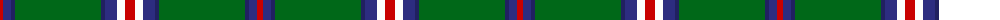

The parent of this is [Mullikin (2013)](/tartans/r/6/db8/dba4/g86/dba4/db12/w8/r/10/)

This was sourced from tartans-authority.  It is a [8 stripes tartan](/stripes/stripes8/).

Original link http://www.tartansauthority.com/tartan-ferret/display/10863/

## Thread count
R/6 DB8 DBa4 G86 DBa4 DB12 W8 R/10

## Palette
Each colour and its ΔE from the base-6 reference it is a variant of.

| Colour | Shade | Base | ΔE (OKLab) |
|---|---|---|---|
| DB |  `#2C2C80` | B  | 0.05 |
| DBa |  `#202060` | B  | 0.11 |
| G |  `#006818` | G  | 0.02 |
| R |  `#C80000` | R  | 0.00 |
| W |  `#FCFCFC` | W  | 0.03 |

# Sample pattern

ID: /variants/r/6/db8/dba4/g86/dba4/db12/w8/r/10-db2c2c80-dba202060-g006818-rc80000-wfcfcfc/
