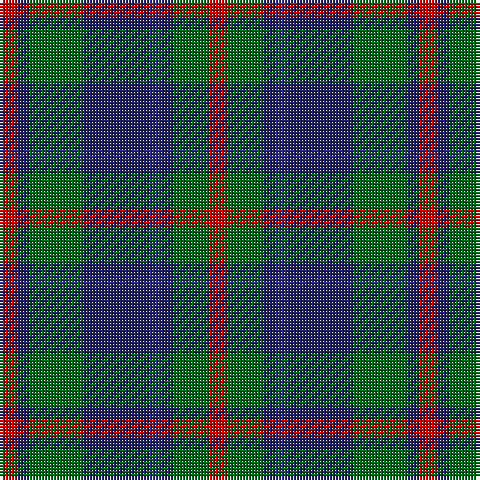

The parent of this is [Daks (Navy)](/tartans/r/6/dba4/g18/dba22/db4/dba4/g12/r/6/)

This was sourced from register-of-tartans.  It is a [8 stripes tartan](/stripes/stripes8/).

Original link https://www.tartanregister.gov.uk/tartanDetails.aspx?ref=873

## Thread count
R/6 DBa4 G18 DBa22 DB4 DBa4 G12 R/6

## Palette
Each colour and its ΔE from the base-6 reference it is a variant of.

| Colour | Shade | Base | ΔE (OKLab) |
|---|---|---|---|
| DB |  `#2C2C80` | B  | 0.05 |
| DBa |  `#202060` | B  | 0.11 |
| G |  `#006818` | G  | 0.02 |
| R |  `#C80000` | R  | 0.00 |

# Sample pattern

ID: /variants/r/6/dba4/g18/dba22/db4/dba4/g12/r/6-db2c2c80-dba202060-g006818-rc80000/
