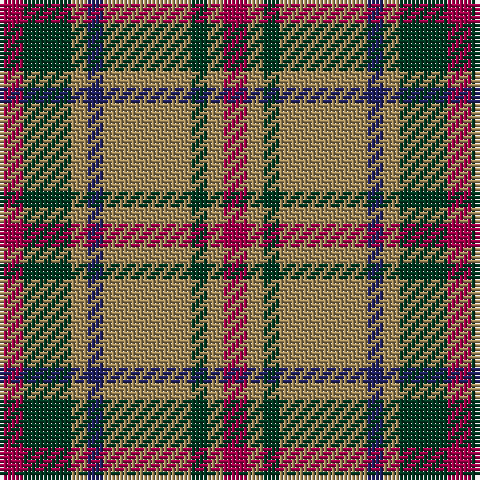

The parent of this is [Invertere (Daks #1) (Fashion)](/tartans/r/6/dg12/lt4/db4/lt22/dg4/lt4/r/6/)

This was sourced from tartans-authority.  It is a [8 stripes tartan](/stripes/stripes8/).

Original link http://www.tartansauthority.com/tartan-ferret/display/1540/

## Thread count
R/6 DG12 LT4 DB4 LT22 DG4 LT4 R/6

## Palette
Each colour and its ΔE from the base-6 reference it is a variant of.

| Colour | Shade | Base | ΔE (OKLab) |
|---|---|---|---|
| DB |  `#202060` | B  | 0.11 |
| DG |  `#003820` | G  | 0.16 |
| LT |  `#A08858` | Y  | 0.21 |
| R |  `#A00048` | R  | 0.11 |

# Sample pattern

ID: /variants/r/6/dg12/lt4/db4/lt22/dg4/lt4/r/6-db202060-dg003820-lta08858-ra00048/
