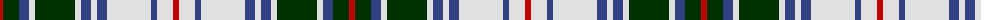

The parent of this is [Flora MacDonald dancing](/tartans/r/6/dg16/b10/ln6/dg40/ln6/b10/ln6/b10/ln44/b6/ln16/r/6/)

This was sourced from weddslist.  It is a [13 stripes tartan](/stripes/stripes13/).

Original link http://www.weddslist.com/cgi-bin/tartans/pg.pl?source=sts

## Thread count
R/6 DG16 B10 LN6 DG40 LN6 B10 LN6 B10 LN44 B6 LN16 R/6

## Palette
Each colour and its ΔE from the base-6 reference it is a variant of.

| Colour | Shade | Base | ΔE (OKLab) |
|---|---|---|---|
| B |  `#304080` | B  | 0.01 |
| DG |  `#003000` | G  | 0.18 |
| LN |  `#E0E0E0` | W  | 0.06 |
| R |  `#C00000` | R  | 0.02 |

ID: /variants/r/6/dg16/b10/ln6/dg40/ln6/b10/ln6/b10/ln44/b6/ln16/r/6-b304080-dg003000-lne0e0e0-rc00000/
