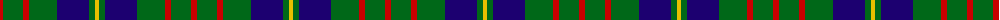
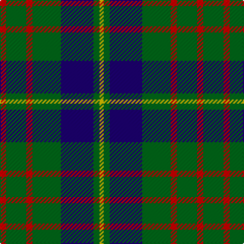

The parent of this is [Cameron of Locheil Htg (1952) (Clan)](/tartans/r/6/g20/r6/g28/db32/g6/y/4/)

This was sourced from tartans-authority.  It is a [7 stripes tartan](/stripes/stripes7/).

Original link http://www.tartansauthority.com/tartan-ferret/display/1535/

## Thread count
R/6 G20 R6 G28 DB32 G6 Y/4

## Palette
Each colour and its ΔE from the base-6 reference it is a variant of.

| Colour | Shade | Base | ΔE (OKLab) |
|---|---|---|---|
| DB |  `#1C0070` | B  | 0.14 |
| G |  `#006818` | G  | 0.02 |
| R |  `#C80000` | R  | 0.00 |
| Y |  `#E8C000` | Y  | 0.00 |

# Sample pattern

ID: /variants/r/6/g20/r6/g28/db32/g6/y/4-db1c0070-g006818-rc80000-ye8c000/
