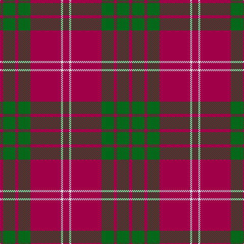

The parent of this is [Crawford Clan Tartan Tartan Number: 1515. Earliest known date: 1842 From a story about the early days of the Black Watch, in 1739, we know that there was no Crawford tartan at that time. The first record is in the Vestiarium Scoticum of 1842. It would appear that the tartan was designed sometime between these dates possibly by the Sobieski Stuart brothers. See products available Copyright © Blair Urquhart, Comrie, 2015](/tartans/r/6/g24/r6/g24/r60/ln4/r/12/)

This was sourced from house-of-tartan.  It is a [7 stripes tartan](/stripes/stripes7/).

Original link http://www.house-of-tartan.scotland.net/house/TartanViewjs.asp?colr=Def&tnam=1515

## Thread count
R/6 G24 R6 G24 R60 LN4 R/12

## Palette
Each colour and its ΔE from the base-6 reference it is a variant of.

| Colour | Shade | Base | ΔE (OKLab) |
|---|---|---|---|
| G |  `#006818` | G  | 0.02 |
| LN |  `#E0E0E0` | W  | 0.06 |
| R |  `#A00048` | R  | 0.11 |

# Sample pattern

ID: /variants/r/6/g24/r6/g24/r60/ln4/r/12-g006818-lne0e0e0-ra00048/
