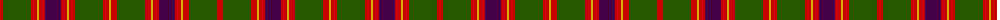

The parent of this is [Wilson's No.213](/tartans/r/6/g28/r6/y2/r6/dp16/r6/y2/r6/g28/r6/y/2/)

This was sourced from register-of-tartans.  It is a [12 stripes tartan](/stripes/stripes12/).

Original link https://www.tartanregister.gov.uk/tartanDetails.aspx?ref=4744

## Thread count
R/6 G28 R6 Y2 R6 DP16 R6 Y2 R6 G28 R6 Y/2

## Palette
Each colour and its ΔE from the base-6 reference it is a variant of.

| Colour | Shade | Base | ΔE (OKLab) |
|---|---|---|---|
| DG |  `#003820` | G  | 0.16 |
| DP |  `#440044` | B  | 0.17 |
| G |  `#285800` | G  | 0.04 |
| P |  `#780078` | B  | 0.16 |
| R |  `#C80000` | R  | 0.00 |
| Ra |  `#C80000` | R  | 0.00 |
| Y |  `#D8B000` | Y  | 0.05 |

ID: /variants/r/6/g28/r6/y2/r6/dp16/r6/y2/r6/g28/r6/y/2-dg003820-dp440044-g285800-p780078-rc80000-rac80000-yd8b000/
