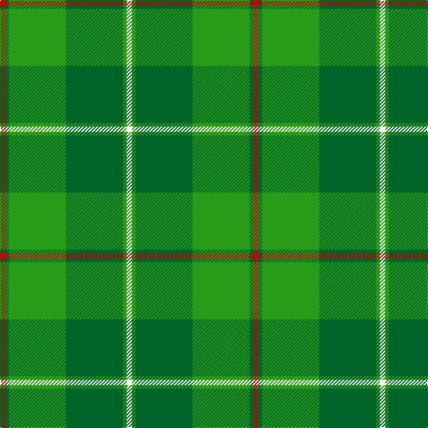

The parent of this is [Galloway Hunting (District)](/tartans/r/6/g4/ga64/g64/ga4/w/6/)

This was sourced from tartans-authority.  It is a [6 stripes tartan](/stripes/stripes6/).

Original link http://www.tartansauthority.com/tartan-ferret/display/1467/

## Thread count
R/6 G4 Ga64 G64 Ga4 W/6

## Palette
Each colour and its ΔE from the base-6 reference it is a variant of.

| Colour | Shade | Base | ΔE (OKLab) |
|---|---|---|---|
| G |  `#006428` | G  | 0.03 |
| Ga |  `#289C18` | G  | 0.18 |
| R |  `#C80000` | R  | 0.00 |
| W |  `#FCFCFC` | W  | 0.03 |

# Sample pattern

ID: /variants/r/6/g4/ga64/g64/ga4/w/6-g006428-ga289c18-rc80000-wfcfcfc/
