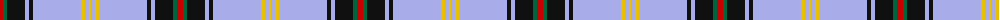

The parent of this is [Bell Family Tartan Tartan Number: 1489. Earliest known date: 1984 Designed for William H. Bell, Colonel, USAF Ret., President of the Bell Family Association of the United States (Clan Bell). The Bells are one of the eight great riding Clans of the Borders. See products available Copyright © Blair Urquhart, Comrie, 2015](/tartans/r/6/g4/k18/lp4/k4/lp48/y4/lp4/y/2/)

This was sourced from house-of-tartan.  It is a [9 stripes tartan](/stripes/stripes9/).

Original link http://www.house-of-tartan.scotland.net/house/TartanViewjs.asp?colr=Def&tnam=1489

## Thread count
R/6 G4 K18 LP4 K4 LP48 Y4 LP4 Y/2

## Palette
Each colour and its ΔE from the base-6 reference it is a variant of.

| Colour | Shade | Base | ΔE (OKLab) |
|---|---|---|---|
| G |  `#00643C` | G  | 0.06 |
| K |  `#101010` | K  | 0.17 |
| LP |  `#A8ACE8` | W  | 0.22 |
| R |  `#C80000` | R  | 0.00 |
| Y |  `#E8C000` | Y  | 0.00 |

ID: /variants/r/6/g4/k18/lp4/k4/lp48/y4/lp4/y/2-g00643c-k101010-lpa8ace8-rc80000-ye8c000/
