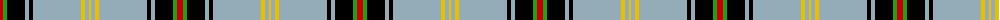

The parent of this is [Bell of the Borders (Name)](/tartans/r/6/g4/k18/n4/k4/n48/y4/n4/y/2/)

This was sourced from tartans-authority.  It is a [9 stripes tartan](/stripes/stripes9/).

Original link http://www.tartansauthority.com/tartan-ferret/display/1489/

## Thread count
R/6 G4 K18 N4 K4 N48 Y4 N4 Y/2

## Palette
Each colour and its ΔE from the base-6 reference it is a variant of.

| Colour | Shade | Base | ΔE (OKLab) |
|---|---|---|---|
| G |  `#289C18` | G  | 0.18 |
| K |  `#000000` | K  | 0.00 |
| N |  `#94ACB8` | Y  | 0.21 |
| R |  `#C80000` | R  | 0.00 |
| Y |  `#E8C000` | Y  | 0.00 |

ID: /variants/r/6/g4/k18/n4/k4/n48/y4/n4/y/2-g289c18-k000000-n94acb8-rc80000-ye8c000/
