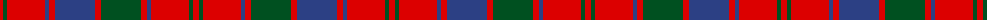

The parent of this is [Robertson Curtain](/tartans/r/6/g4/r38/b4/r6/b40/r6/g40/r6/b4/r38/g4/r/6/)

This was sourced from register-of-tartans.  It is a [13 stripes tartan](/stripes/stripes13/).

Original link https://www.tartanregister.gov.uk/tartanDetails.aspx?ref=3529

## Thread count
R/6 G4 R38 B4 R6 B40 R6 G40 R6 B4 R38 G4 R/6

## Palette
Each colour and its ΔE from the base-6 reference it is a variant of.

| Colour | Shade | Base | ΔE (OKLab) |
|---|---|---|---|
| B |  `#2C4084` | B  | 0.00 |
| G |  `#005020` | G  | 0.08 |
| R |  `#DC0000` | R  | 0.04 |

ID: /variants/r/6/g4/r38/b4/r6/b40/r6/g40/r6/b4/r38/g4/r/6-b2c4084-g005020-rdc0000/
