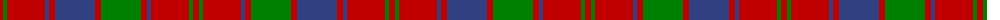

The parent of this is [Robertson, Curtain](/tartans/r/6/g4/r38/b4/r6/b40/r6/g40/r6/b4/r38/g4/r/6/)

This was sourced from weddslist.  It is a [13 stripes tartan](/stripes/stripes13/).

Original link http://www.weddslist.com/cgi-bin/tartans/pg.pl?source=sts

## Thread count
R/6 G4 R38 B4 R6 B40 R6 G40 R6 B4 R38 G4 R/6

## Palette
Each colour and its ΔE from the base-6 reference it is a variant of.

| Colour | Shade | Base | ΔE (OKLab) |
|---|---|---|---|
| B |  `#304080` | B  | 0.01 |
| G |  `#008000` | G  | 0.09 |
| R |  `#C00000` | R  | 0.02 |

ID: /variants/r/6/g4/r38/b4/r6/b40/r6/g40/r6/b4/r38/g4/r/6-b304080-g008000-rc00000/
