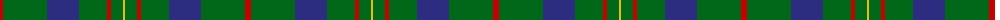

The parent of this is [Scottish Scouts Corporate Tartan Tartan Number: 1463. Earliest known date: 1957 This tartan currently in use for Scottish Scouts is based upon the MacLaren, in honour of a MacLaren who gave an estate to the movement. On the blue and green base the strong red overcheck represents the Rover Scouts, the finer red lines, the Scouts and Senior Scouts and yellow the Wolf Cubs. See products available Copyright © Blair Urquhart, Comrie, 2015](/tartans/r/6/g44/db32/g28/r4/g12/y/2/)

This was sourced from house-of-tartan.  It is a [7 stripes tartan](/stripes/stripes7/).

Original link http://www.house-of-tartan.scotland.net/house/TartanViewjs.asp?colr=Def&tnam=1463

## Thread count
R/6 G44 DB32 G28 R4 G12 Y/2

## Palette
Each colour and its ΔE from the base-6 reference it is a variant of.

| Colour | Shade | Base | ΔE (OKLab) |
|---|---|---|---|
| DB |  `#2C2C80` | B  | 0.05 |
| G |  `#006818` | G  | 0.02 |
| R |  `#C80000` | R  | 0.00 |
| Y |  `#E8C000` | Y  | 0.00 |

# Sample pattern

ID: /variants/r/6/g44/db32/g28/r4/g12/y/2-db2c2c80-g006818-rc80000-ye8c000/
