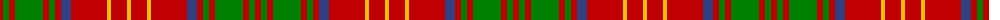

The parent of this is [Burns](/tartans/r/6/g6/r6/g28/r6/g6/r6/b10/r36/y4/r16/y/4/)

This was sourced from weddslist.  It is a [12 stripes tartan](/stripes/stripes12/).

Original link http://www.weddslist.com/cgi-bin/tartans/pg.pl?source=sts

## Thread count
R/6 G6 R6 G28 R6 G6 R6 B10 R36 Y4 R16 Y/4

## Palette
Each colour and its ΔE from the base-6 reference it is a variant of.

| Colour | Shade | Base | ΔE (OKLab) |
|---|---|---|---|
| B |  `#304080` | B  | 0.01 |
| G |  `#008000` | G  | 0.09 |
| R |  `#C00000` | R  | 0.02 |
| Y |  `#F0C000` | Y  | 0.01 |

ID: /variants/r/6/g6/r6/g28/r6/g6/r6/b10/r36/y4/r16/y/4-b304080-g008000-rc00000-yf0c000/
