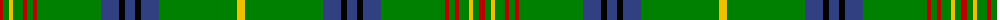

The parent of this is [Kennedy](/tartans/r/6/g6/y4/g10/r4/g6/r4/g64/b18/k6/b10/k6/b18/g78/y/8/)

This was sourced from weddslist.  It is a [15 stripes tartan](/stripes/stripes15/).

Original link http://www.weddslist.com/cgi-bin/tartans/pg.pl?source=sts

## Thread count
R/6 G6 Y4 G10 R4 G6 R4 G64 B18 K6 B10 K6 B18 G78 Y/8

## Palette
Each colour and its ΔE from the base-6 reference it is a variant of.

| Colour | Shade | Base | ΔE (OKLab) |
|---|---|---|---|
| B |  `#304080` | B  | 0.01 |
| G |  `#008000` | G  | 0.09 |
| K |  `#000000` | K  | 0.00 |
| R |  `#C00000` | R  | 0.02 |
| Y |  `#F0C000` | Y  | 0.01 |

ID: /variants/r/6/g6/y4/g10/r4/g6/r4/g64/b18/k6/b10/k6/b18/g78/y/8-b304080-g008000-k000000-rc00000-yf0c000/
