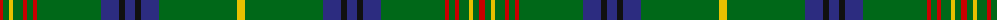

The parent of this is [Holmes (Clan)](/tartans/r/6/g6/y4/g10/r4/g6/r4/g64/db18/k6/db10/k6/db18/g78/y/8/)

This was sourced from tartans-authority.  It is a [15 stripes tartan](/stripes/stripes15/).

Original link http://www.tartansauthority.com/tartan-ferret/display/5729/

## Thread count
R/6 G6 Y4 G10 R4 G6 R4 G64 DB18 K6 DB10 K6 DB18 G78 Y/8

## Palette
Each colour and its ΔE from the base-6 reference it is a variant of.

| Colour | Shade | Base | ΔE (OKLab) |
|---|---|---|---|
| DB |  `#2C2C80` | B  | 0.05 |
| G |  `#006818` | G  | 0.02 |
| K |  `#101010` | K  | 0.17 |
| R |  `#C80000` | R  | 0.00 |
| Y |  `#E8C000` | Y  | 0.00 |

ID: /variants/r/6/g6/y4/g10/r4/g6/r4/g64/db18/k6/db10/k6/db18/g78/y/8-db2c2c80-g006818-k101010-rc80000-ye8c000/
