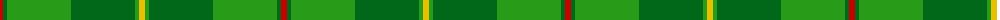
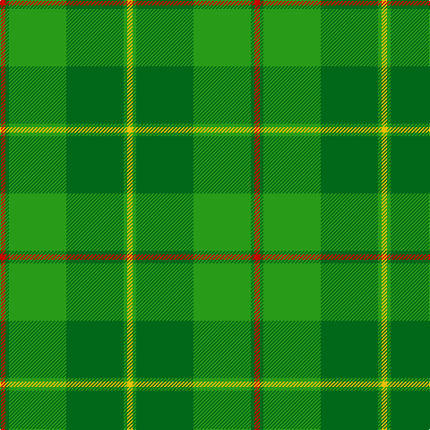

The parent of this is [Galloway, Green (yellow line) (Dist)](/tartans/r/6/ga4/g64/ga64/g4/y/6/)

This was sourced from tartans-authority.  It is a [6 stripes tartan](/stripes/stripes6/).

Original link http://www.tartansauthority.com/tartan-ferret/display/1469/

## Thread count
R/6 Ga4 G64 Ga64 G4 Y/6

## Palette
Each colour and its ΔE from the base-6 reference it is a variant of.

| Colour | Shade | Base | ΔE (OKLab) |
|---|---|---|---|
| G |  `#289C18` | G  | 0.18 |
| Ga |  `#006818` | G  | 0.02 |
| R |  `#C80000` | R  | 0.00 |
| Y |  `#E8C000` | Y  | 0.00 |

# Sample pattern

ID: /variants/r/6/ga4/g64/ga64/g4/y/6-g289c18-ga006818-rc80000-ye8c000/
