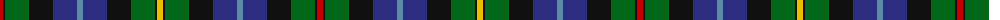

The parent of this is [Smith Family Tartan Tartan Number: 488. Earliest known date: pre 2003 This is Gow Hunting tartan with the dark blue stripe changed to azure. Gow is the Gaelic form of Smith meaning metal worker or armourer. There is an alternative Smith sett designed for Smith of Pennylands, the founder of the Boys Brigade. See products available Copyright © Blair Urquhart, Comrie, 2015](/tartans/r/6/k2/g24/k24/db24/b6/db24/k24/g24/k2/y/6/)

This was sourced from house-of-tartan.  It is a [11 stripes tartan](/stripes/stripes11/).

Original link http://www.house-of-tartan.scotland.net/house/TartanViewjs.asp?colr=Def&tnam=488

## Thread count
R/6 K2 G24 K24 DB24 B6 DB24 K24 G24 K2 Y/6

## Palette
Each colour and its ΔE from the base-6 reference it is a variant of.

| Colour | Shade | Base | ΔE (OKLab) |
|---|---|---|---|
| B |  `#5C8CA8` | B  | 0.23 |
| DB |  `#2C2C80` | B  | 0.05 |
| G |  `#006818` | G  | 0.02 |
| K |  `#101010` | K  | 0.17 |
| R |  `#C80000` | R  | 0.00 |
| Y |  `#E8C000` | Y  | 0.00 |

ID: /variants/r/6/k2/g24/k24/db24/b6/db24/k24/g24/k2/y/6-b5c8ca8-db2c2c80-g006818-k101010-rc80000-ye8c000/
