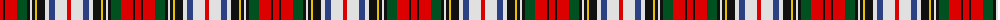

The parent of this is [Victoria (Patons)](/tartans/r/6/k2/r12/g10/k3/ln2/k3/y2/k8/ln4/b6/ln12/r/4/)

This was sourced from register-of-tartans.  It is a [13 stripes tartan](/stripes/stripes13/).

Original link https://www.tartanregister.gov.uk/tartanDetails.aspx?ref=4452

## Thread count
R/6 K2 R12 G10 K3 LN2 K3 Y2 K8 LN4 B6 LN12 R/4

## Palette
Each colour and its ΔE from the base-6 reference it is a variant of.

| Colour | Shade | Base | ΔE (OKLab) |
|---|---|---|---|
| B |  `#2C4084` | B  | 0.00 |
| G |  `#005020` | G  | 0.08 |
| K |  `#101010` | K  | 0.17 |
| LN |  `#E0E0E0` | W  | 0.06 |
| R |  `#DC0000` | R  | 0.04 |
| Y |  `#E8C000` | Y  | 0.00 |

ID: /variants/r/6/k2/r12/g10/k3/ln2/k3/y2/k8/ln4/b6/ln12/r/4-b2c4084-g005020-k101010-lne0e0e0-rdc0000-ye8c000/
