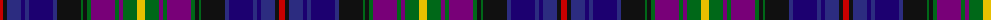

The parent of this is [MacWatts (Personal)](/tartans/r/6/k4/db14/dba4/db4/dba24/db4/k24/g2/k4/g4/p24/g4/p4/g14/y/8/)

This was sourced from tartans-authority.  It is a [16 stripes tartan](/stripes/stripes16/).

Original link http://www.tartansauthority.com/tartan-ferret/display/6662/

## Thread count
R/6 K4 DB14 DBa4 DB4 DBa24 DB4 K24 G2 K4 G4 P24 G4 P4 G14 Y/8

## Palette
Each colour and its ΔE from the base-6 reference it is a variant of.

| Colour | Shade | Base | ΔE (OKLab) |
|---|---|---|---|
| DB |  `#2C2C80` | B  | 0.05 |
| DBa |  `#1C0070` | B  | 0.14 |
| G |  `#006818` | G  | 0.02 |
| K |  `#101010` | K  | 0.17 |
| P |  `#780078` | B  | 0.16 |
| R |  `#C80000` | R  | 0.00 |
| Y |  `#E8C000` | Y  | 0.00 |

ID: /variants/r/6/k4/db14/dba4/db4/dba24/db4/k24/g2/k4/g4/p24/g4/p4/g14/y/8-db2c2c80-dba1c0070-g006818-k101010-p780078-rc80000-ye8c000/
