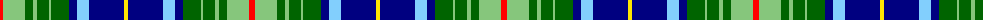

The parent of this is [Bruntsfield Links Golfing Society](/tartans/r/6/lg22/g8/lg4/g12/lg2/g18/db8/lb12/db35/y/4/)

This was sourced from register-of-tartans.  It is a [11 stripes tartan](/stripes/stripes11/).

Original link https://www.tartanregister.gov.uk/tartanDetails.aspx?ref=10316

## Thread count
R/6 LG22 G8 LG4 G12 LG2 G18 DB8 LB12 DB35 Y/4

## Palette
Each colour and its ΔE from the base-6 reference it is a variant of.

| Colour | Shade | Base | ΔE (OKLab) |
|---|---|---|---|
| DB |  `#000080` | B  | 0.14 |
| G |  `#006400` | G  | 0.00 |
| LB |  `#82CFFD` | W  | 0.18 |
| LG |  `#86C67C` | Y  | 0.14 |
| R |  `#FF0000` | R  | 0.11 |
| Y |  `#FFE600` | Y  | 0.10 |

ID: /variants/r/6/lg22/g8/lg4/g12/lg2/g18/db8/lb12/db35/y/4-db000080-g006400-lb82cffd-lg86c67c-rff0000-yffe600/
