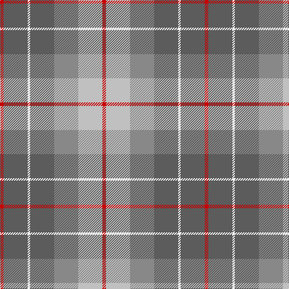

The parent of this is [Brodie Silver](/tartans/r/6/n40/y4/n40/na40/nb40/r/6/)

This was sourced from register-of-tartans.  It is a [7 stripes tartan](/stripes/stripes7/).

Original link https://www.tartanregister.gov.uk/tartanDetails.aspx?ref=373

## Thread count
R/6 N40 Y4 N40 Na40 Nb40 R/6

## Palette
Each colour and its ΔE from the base-6 reference it is a variant of.

| Colour | Shade | Base | ΔE (OKLab) |
|---|---|---|---|
| N |  `#5C5C5C` | B  | 0.14 |
| Na |  `#888888` | R  | 0.24 |
| Nb |  `#C0C0C0` | W  | 0.16 |
| R |  `#C80000` | R  | 0.00 |

# Sample pattern

ID: /variants/r/6/n40/y4/n40/na40/nb40/r/6-n5c5c5c-na888888-nbc0c0c0-rc80000/
