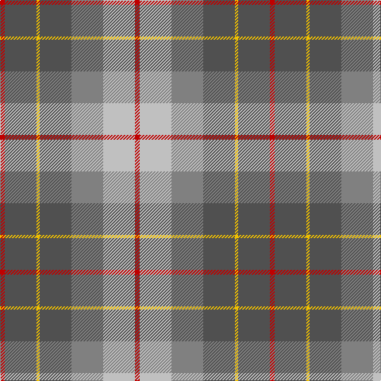

The parent of this is [Brodie, Silver](/tartans/r/6/n40/y4/n40/nb40/na40/r/6/)

This was sourced from weddslist.  It is a [7 stripes tartan](/stripes/stripes7/).

Original link http://www.weddslist.com/cgi-bin/tartans/pg.pl?source=sts

## Thread count
R/6 N40 Y4 N40 Nb40 Na40 R/6

## Palette
Each colour and its ΔE from the base-6 reference it is a variant of.

| Colour | Shade | Base | ΔE (OKLab) |
|---|---|---|---|
| N |  `#505050` | B  | 0.12 |
| Na |  `#C0C0C0` | W  | 0.16 |
| Nb |  `#808080` | G  | 0.22 |
| R |  `#C00000` | R  | 0.02 |
| Y |  `#F0C000` | Y  | 0.01 |

# Sample pattern

ID: /variants/r/6/n40/y4/n40/nb40/na40/r/6-n505050-nac0c0c0-nb808080-rc00000-yf0c000/
