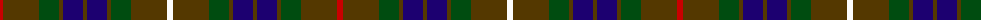

The parent of this is [Fraser Htg (Clan)](/tartans/r/6/t36/g20/t4/db20/t4/db20/t4/g20/t36/w/6/)

This was sourced from tartans-authority.  It is a [11 stripes tartan](/stripes/stripes11/).

Original link http://www.tartansauthority.com/tartan-ferret/display/1659/

## Thread count
R/6 T36 G20 T4 DB20 T4 DB20 T4 G20 T36 W/6

## Palette
Each colour and its ΔE from the base-6 reference it is a variant of.

| Colour | Shade | Base | ΔE (OKLab) |
|---|---|---|---|
| DB |  `#1C0070` | B  | 0.14 |
| G |  `#004C10` | G  | 0.08 |
| R |  `#C80000` | R  | 0.00 |
| T |  `#543800` | G  | 0.15 |
| W |  `#FCFCFC` | W  | 0.03 |

ID: /variants/r/6/t36/g20/t4/db20/t4/db20/t4/g20/t36/w/6-db1c0070-g004c10-rc80000-t543800-wfcfcfc/
