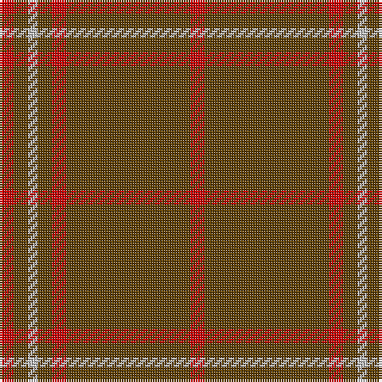

The parent of this is [Scott Htg (Error 2)](/tartans/r/6/t6/n4/t6/r6/t20/t32/r/6/)

This was sourced from tartans-authority.  It is a [8 stripes tartan](/stripes/stripes8/).

Original link http://www.tartansauthority.com/tartan-ferret/display/8838/

## Thread count
R/6 T6 N4 T6 R6 T20 T32 R/6

## Palette
Each colour and its ΔE from the base-6 reference it is a variant of.

| Colour | Shade | Base | ΔE (OKLab) |
|---|---|---|---|
| N |  `#C0C0C0` | W  | 0.16 |
| R |  `#C80000` | R  | 0.00 |
| T |  `#604000` | G  | 0.14 |

# Sample pattern

ID: /variants/r/6/t6/n4/t6/r6/t20/t32/r/6-nc0c0c0-rc80000-t604000/
