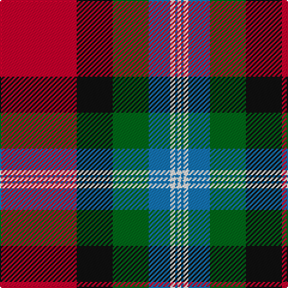

The parent of this is [Clyde (Personal)](/tartans/r/64/k30/g30/b18/w4/b2/w/3/)

This was sourced from tartans-authority.  It is a [7 stripes tartan](/stripes/stripes7/).

Original link http://www.tartansauthority.com/tartan-ferret/display/10532/

## Thread count
R/64 K30 G30 B18 W4 B2 W/3

## Palette
Each colour and its ΔE from the base-6 reference it is a variant of.

| Colour | Shade | Base | ΔE (OKLab) |
|---|---|---|---|
| B |  `#1474B4` | B  | 0.15 |
| G |  `#006818` | G  | 0.02 |
| K |  `#101010` | K  | 0.17 |
| R |  `#C8002C` | R  | 0.03 |
| W |  `#FCFCFC` | W  | 0.03 |

# Sample pattern

ID: /variants/r/64/k30/g30/b18/w4/b2/w/3-b1474b4-g006818-k101010-rc8002c-wfcfcfc/
